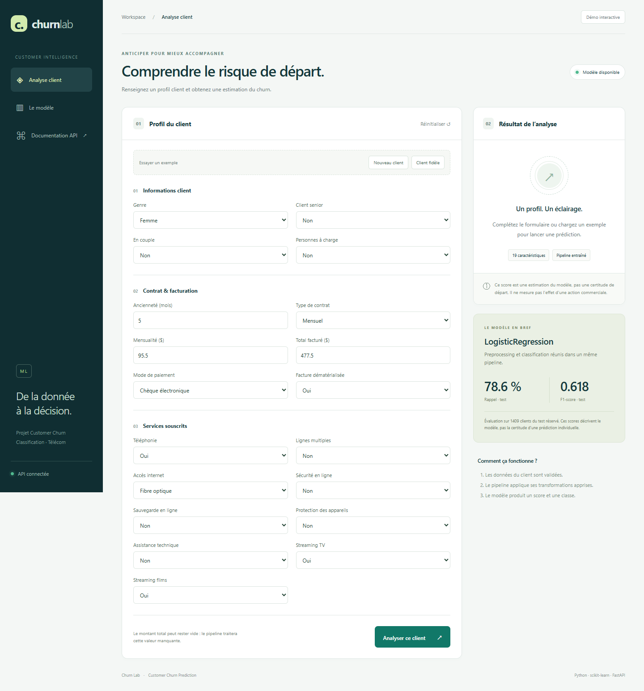
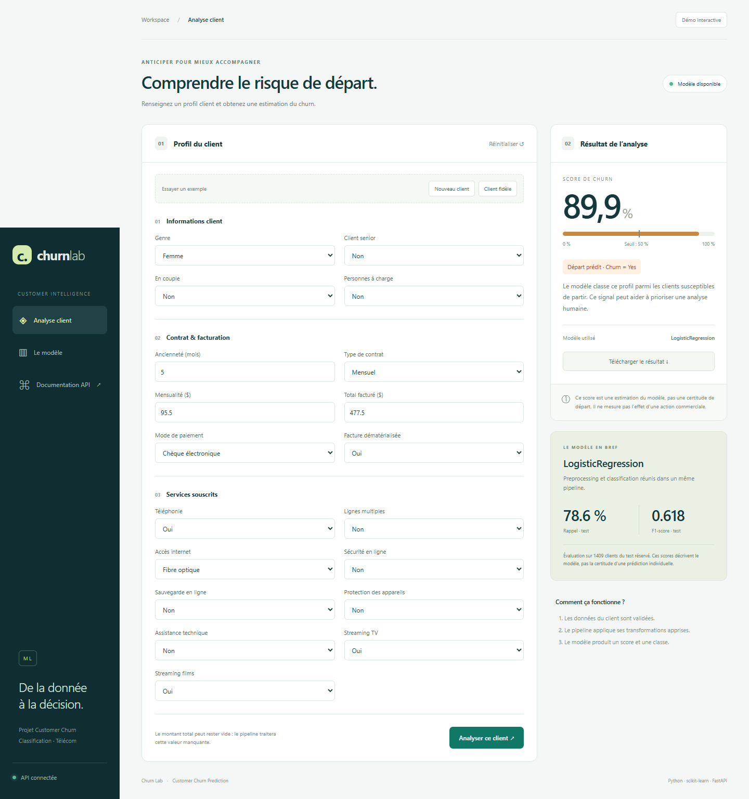
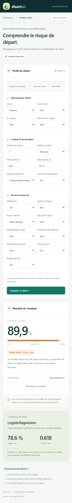
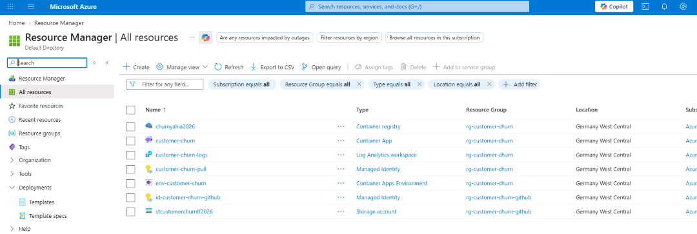

<h1 align="center">Customer Churn Prediction</h1>

<p align="center">Prédiction du départ de clients télécoms avec scikit-learn, FastAPI et une interface web.</p>

<p align="center">
  <a href="#démarrage-local">Démarrer</a> ·
  <a href="#api-et-prédiction">API</a> ·
  <a href="#cicd-et-infrastructure">CI/CD</a>
</p>

Le projet entraîne plusieurs classifieurs sur les données client, conserve le meilleur pipeline selon le F1-score et expose ses prédictions via une API. L'interface permet de saisir un profil, de consulter sa probabilité de churn et de télécharger le résultat.

## Interface

Les trois captures sont intégrées ci-dessous. Cliquez sur une image pour l'ouvrir en taille réelle.

| Formulaire ordinateur | Résultat ordinateur | Résultat mobile |
| :---: | :---: | :---: |
| <a href="artifacts/screenshots/desktop-form.png"></a> | <a href="artifacts/screenshots/desktop-result.png"></a> | <a href="artifacts/screenshots/mobile-result.png"></a> |

L'interface propose deux profils d'exemple, vérifie la disponibilité du modèle et affiche la classe prédite avec un score de probabilité. Ce score est une estimation statistique, pas une certitude concernant un client.

## Fonctionnement

```text
data/raw/churn.csv
       │
       ▼
Validation et préparation des 19 caractéristiques
       │
       ▼
Comparaison de 4 classifieurs par validation croisée
       │
       ▼
Recherche de paramètres sur les 2 meilleurs modèles
       │
       ▼
Évaluation sur un jeu de test réservé
       │
       ▼
Pipeline joblib + rapport JSON → API FastAPI → interface web
```

Les modèles comparés sont la régression logistique, l'arbre de décision, la forêt aléatoire et XGBoost. La sélection et la recherche de paramètres utilisent le **F1-score**. Les transformations numériques et catégorielles sont incluses dans le pipeline scikit-learn, afin d'appliquer la même préparation à l'entraînement et à la prédiction.

### Résultats du modèle enregistré

Le rapport versionné [`models/churn_pipeline.json`](models/churn_pipeline.json) décrit une **régression logistique** évaluée sur **1 409 clients** réservés au test :

| Mesure | Résultat |
| --- | ---: |
| Exactitude | 74,2 % |
| Précision | 50,9 % |
| Rappel | 78,6 % |
| F1-score | 0,618 |
| ROC-AUC | 0,841 |

Ces mesures décrivent le modèle enregistré dans le rapport. Un nouvel entraînement peut produire un autre modèle ou d'autres scores. La classe `Yes` est prédite à partir d'un seuil de probabilité de **0,5**.

## Démarrage local

Prérequis : **Python 3.14** et `pip`. Depuis la racine du dépôt, dans un terminal Bash :

```bash
python -m venv .venv
source .venv/bin/activate
python -m pip install -r requirements.txt
python run_pipeline.py --evaluate
python -m uvicorn api.main:app --host 127.0.0.1 --port 8000
```

Ouvrir ensuite **http://127.0.0.1:8000**. La documentation interactive de l'API est disponible sur **http://127.0.0.1:8000/docs**.

La commande d'entraînement crée `models/churn_pipeline.joblib` et met à jour `models/churn_pipeline.json`. Le fichier `.joblib` est ignoré par Git : il faut l'avoir généré avant de lancer l'application ou de construire l'image Docker. Le rapport JSON suivi par Git peut apparaître modifié après un nouvel entraînement.

### Avec Docker Compose

Après avoir généré le modèle :

```bash
docker compose up --build
```

L'application est alors accessible sur **http://127.0.0.1:8000**. Le conteneur embarque le pipeline entraîné et expose un contrôle de santé sur `/health`.

## API et prédiction

| Route | Rôle |
| --- | --- |
| `GET /` | Interface web |
| `GET /health` | État de l'API et du chargement du modèle |
| `GET /schema` | Liste des caractéristiques et valeurs autorisées |
| `GET /model-info` | Nom du modèle et métriques disponibles |
| `POST /predict` | Prédiction pour un profil client |
| `GET /docs` | Documentation OpenAPI interactive |

Exemple d'appel avec le profil fourni dans le dépôt :

```bash
curl -X POST http://127.0.0.1:8000/predict \
  -H 'Content-Type: application/json' \
  --data-binary @examples/customer.json
```

La réponse contient `prediction` (`Yes` ou `No`), `churn_probability`, `threshold` et `model_name`. L'API valide les 19 caractéristiques et refuse les combinaisons incohérentes de services téléphoniques ou Internet. `TotalCharges` peut être omis ; le pipeline impute les valeurs manquantes. Pour une prédiction en ligne de commande :

```bash
python -m src.models.predict examples/customer.json
```
### Ressources Azure

La capture ci-dessous présente les ressources provisionnées dans Azure Resource Manager.

<p align="center">
  <a href="artifacts/screenshots/azure-resources.png">
    
  </a>
</p>
<p align="center"><em>Ressources Azure : Container Registry, Container App, Log Analytics, identités managées, environnement Container Apps et stockage d’état Terraform.</em></p>

## CI/CD et infrastructure

| Workflow | Déclenchement | Rôle |
| --- | --- | --- |
| [CI](.github/workflows/ci.yml) | Pull request et push sur `main` | Tests Python, formatage et validation Terraform |
| [CD](.github/workflows/cd.yml) | Après un CI réussi sur un push vers `main` | Déploiement successif vers `dev`, `staging`, puis `production` |
| [Infrastructure](.github/workflows/infra-deploy.yml) | Manuel | Provisionnement Terraform d'un environnement choisi |

Le déploiement utilise **GitHub Actions**, l'authentification Azure **OIDC**, **Terraform**, **Azure Container Registry** et **Azure Container Apps**. Chaque environnement GitHub doit disposer de ses variables Azure, de son identité fédérée et de sa propre clé d'état Terraform. Les ressources applicatives doivent également être distinctes entre les environnements. Le déploiement de `production` dépend de la réussite de `staging`.

La configuration complète est détaillée dans [`.azure/pipeline-setup.md`](.azure/pipeline-setup.md) et les commandes Terraform locales dans [`deploy/terraform/README.md`](deploy/terraform/README.md).

**État au 27 septembre 2026 :** le déploiement `dev` a réussi et son endpoint `/health` répond. `staging` échoue à l'étape de connexion Azure car ses variables d'environnement GitHub ne sont pas configurées ; `production` est donc ignoré. La configuration de `staging` et `production` demande des identités fédérées, des droits Azure et des ressources propres à chaque environnement.

## Organisation du dépôt

```text
api/                    API FastAPI et interface web
artifacts/screenshots/  Captures de l'interface
data/raw/               Jeu de données d'entraînement
deploy/terraform/       Infrastructure Azure
examples/               Exemple de profil client JSON
models/                 Rapport du modèle ; pipeline joblib généré localement
notebooks/              Exploration des données
src/common/             Contrat de données
src/data/               Nettoyage et prétraitement
src/models/             Entraînement, évaluation, prédiction et suivi MLflow
tests/                  Tests de l'application et du pipeline
```

## Limites d'utilisation

Les performances affichées proviennent d'un jeu de test réservé et ne garantissent pas les performances sur de nouvelles populations. Le résultat individuel est un signal d'aide à l'analyse : il ne mesure ni la cause du départ ni l'effet d'une action commerciale. Le modèle et ses métriques doivent être réévalués lorsque les données évoluent.
